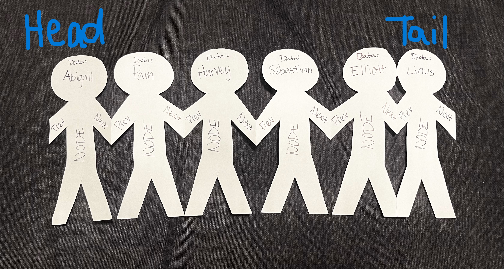
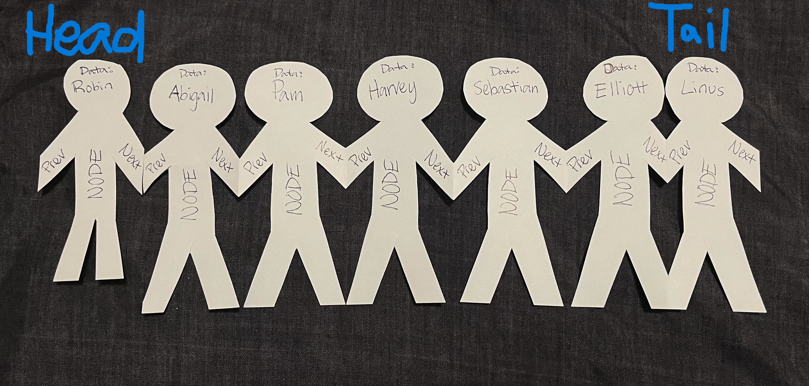
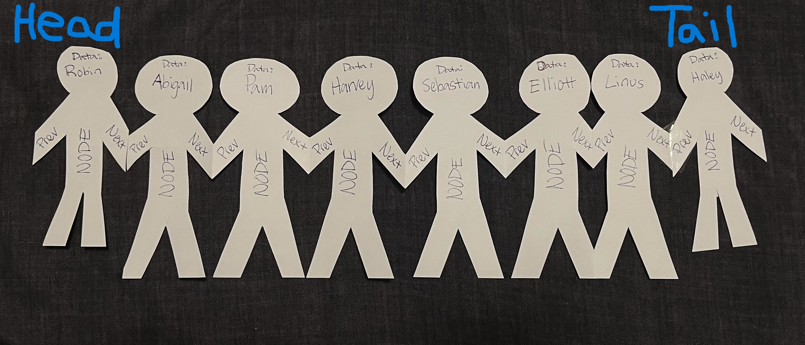
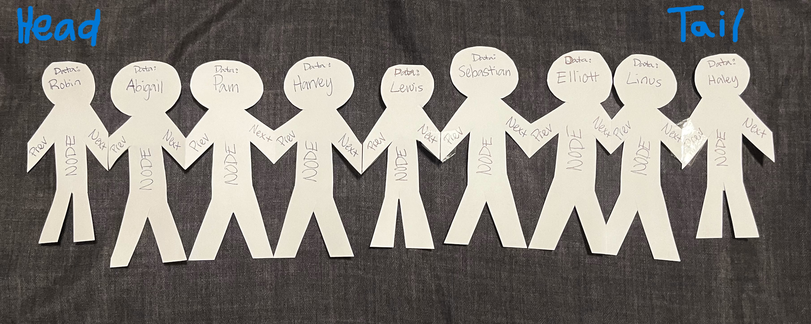
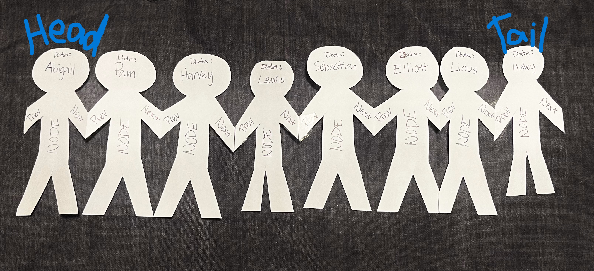
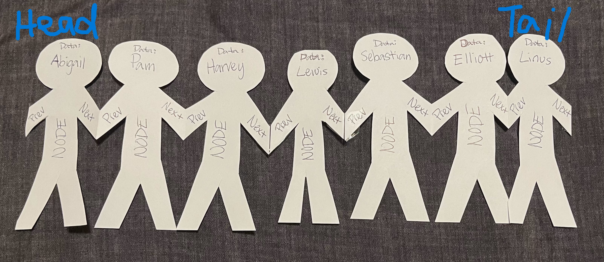
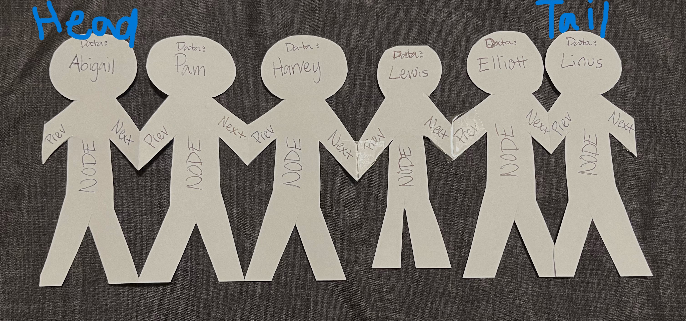

# Linked List

[Back to Home](0-welcome.md)

## Overview

The Linked List data structure is slightly different to most other data structures we see.
Usually, data structures are stored all in one location in memory, with a starting and an ending
location in the memory allocated. That is not how Linked Lists work. Each item in a Linked 
List (called a node) is in a random space in memory. So for the program to keep track of all
the different nodes, the Linked List class has two member Variables: Head (in C# it's called 
"First"), and Tail (in C# it's called "Last"). Each of these member variables points to a 
location in memory with a node. The Head variable points to the first node in the Linked List,
and the Tail variable points to the last node in the Linked List. Then within the node class, 
each node contains the node's value, a pointer to the previous node, and a pointer to the 
next node (in C#, the variables are: Value, Previous, and Next). That way, all the Linked List needs
to know is where to start, and where to end, and each individual node will tell you what came
before it (if is not the Head, which has `null` for it's Value), and what comes next 
(if it is not the Tail). This is how Linked Lists work and how we can move forward and 
backward through them incredibly easily.

Because of how Linked Lists are set up, with just a Head and Tail node, this data structure is
very easy for the computer to add to and remove from (as far as memory goes), because all it
takes is adding or removing a single node in memory, and changing the pointers in the Linked
List object. This is much more efficient that the regular List class because that one creates
an Array of a fixed size, and then any time you want to add more than the allowed size to the 
List, the system has to create a new Array of a bigger size. You can see how simply adding a
single node to memory when you want to add a node to the Linked List would be more efficient 
than creating a new Array if you have to use huge amounts of data. 

For this same reason, adding and removing from the end of a Linked List is very efficient 
to implement. The only thing that's needed is that you create a new node (or to remove,
take the Tail's Previous node), and then adjust the Head or Tail pointers accordingly. The Big-O
for this would only be O(1), from both the beginning and the end, where it was O(n) to add or
remove from the beginning of a List.

To create a new Linked List in C#, we must first include the correct collection, as C# on 
it's own does not include a LinkedList class. So at the top of the program, type:
```c#
using System;
using System.Collections.Generic;
```

You can now use the LinkedList class! Start by instantiating:
```c#
LinkedList<int> myLinkedList = new();
```

Now, you may use any of the methods described below to use your Linked List however you like!

## Methods

### AddFirst

The `AddFirst(value)` method of the Linked List class adds a value to the front of the Linked
List. The way it does this is by:
1. Creating a new node with the given `value` as it's `Value`.
2. Making the new node point to the current Head of the Linked List as the `Next` node.
3. Making the current Head point to the new node as the `Previous` node.
4. Changing the Head to point to the new node.

To use the AddFirst method, simply create a Linked List, and call the method on it with
whatever value you would like to add to the front of the list:
```c#
LinkedList<int> myLinkedList = new();
// myLinkedList: {}

myLinkedList.AddFirst(0);
// myLinkedList: {0}
myLinkedList.AddFirst(1);
// myLinkedList: {1, 0}
myLinkedList.AddFirst(2);
// myLinkedList: {2, 1, 0}
```

The Big-O for this method is O(1) because the method does not affect the placement in memory
of any of the following nodes, it just adds a node and changes some member variables.

### AddLast

The `AddLast(value)` method of the Linked List class adds a value to the back of the Linked
List. The way it does this is by:
1. Creating a new node with the given `value` as it's `Value`.
2. Making the new node point to the current Tail of the Linked List as the `Previous` node.
3. Making the current Tail point to the new node as the `Next` node.
4. Changing the Tail to point to the new node.

To use the AddLast method, simply create a Linked List, and call the method on it with
whatever value you would like to add to the front of the list:
```c#
LinkedList<int> myLinkedList = new();
// myLinkedList: {}

myLinkedList.AddLast(0);
// myLinkedList: {0}
myLinkedList.AddLast(1);
// myLinkedList: {0, 1}
myLinkedList.AddLast(2);
// myLinkedList: {0, 1, 2}
```

The Big-O for this method is O(1) because the method does not affect the placement in memory
of any of the previous nodes, it just adds a node and changes some member variables.

### AddAfter

The `AddAfter(node, value)` method of the Linked List class adds a value to the Linked List 
after a given node. The way it does this is by:
1. Creating a new node with the given `value` as it's `Value`.
2. Making the new node point to the given node as the `Previous` node.
3. Setting the `Next` value of the new node to the `Next` value of the given node.
4. Setting the Next node's `Previous` value to the new node.
5. Setting the given node's `Next` value to the new node.

To use the AddAfter method, simply create a Linked List, populate it, and then add a value
to whatever node you want:
```c#
LinkedList<int> myLinkedList = new();
// myLinkedList: {}

myLinkedList.AddFirst(0);
myLinkedList.AddFirst(1);
myLinkedList.AddFirst(2);
// myLinkedList: {2, 1, 0}

// Sets a variable to point to the second node in myLinkedList
LinkedListNode<int> nodeToAddAfter = myLinkedList.Head.Next

myLinkedList.AddAfter(nodeToAddAfter, 42);
// myLinkedList: {2, 1, 42, 0}
```

The Big-O for this method is O(n) because the method must iterate through the
Linked List to find the node to insert after.

### RemoveFirst

The `RemoveFirst()` method of the Linked List class removes the value at the front of the Linked
List. The way it does this is by:
1. Changing the `Previous` value of the second node (`Head.Next`) to `null`.
2. Changing the Head to point to the new Head (the second node: `Head.Next`).

To use the RemoveFirst method, simply create a Linked List, populate it, and then remove the
first item in the Linked List:
```c#
LinkedList<int> myLinkedList = new();
// myLinkedList: {}

myLinkedList.AddFirst(0);
myLinkedList.AddFirst(1);
myLinkedList.AddFirst(2);
// myLinkedList: {2, 1, 0}

myLinkedList.RemoveFirst();
// myLinkedList: {1, 0}
```

The Big-O for this method is O(1) because the method does not affect the placement in memory
of any of the previous nodes, it just removes a node and changes some member variables.

### RemoveLast

The `RemoveLast()` method of the Linked List class removes the value at the end of the Linked
List. The way it does this is by:
1. Changing the `Next` value of the second to last node (`Tail.Previous`) to `null`.
2. Changing the Tail to point to the new Tail (the second  to last node: `Tail.Previous`).

To use the RemoveLast method, simply create a Linked List, populate it, and then remove the
last item in the Linked List:
```c#
LinkedList<int> myLinkedList = new();
// myLinkedList: {}

myLinkedList.AddFirst(0);
myLinkedList.AddFirst(1);
myLinkedList.AddFirst(2);
// myLinkedList: {2, 1, 0}

myLinkedList.RemoveLast();
// myLinkedList: {2, 1}
```

The Big-O for this method is O(1) because the method does not affect the placement in memory
of any of the previous nodes, it just removes a node and changes some member variables.

### Remove

The `Remove(value)` method of the Linked List class removes the `value` specified from the Linked
List. The way it does this is by:
1. Looping through the Linked List to find the first node with the given value.
2. Making the next node's (`selectedNode.Next`) `Previous` value the previous node (`selectedNode.Previous`).
3. Making the previous node's (`selectedNode.Previous`) `Next` value the node after the chosen one (`selectedNode.Next`).

To use the Remove method, simply create a Linked List, populate it, and then remove the chosen item
in the Linked List:
```c#
LinkedList<int> myLinkedList = new();
// myLinkedList: {}

myLinkedList.AddFirst(0);
myLinkedList.AddFirst(1);
myLinkedList.AddFirst(2);
myLinkedList.AddFirst(1);
// myLinkedList: {1, 2, 1, 0}

myLinkedList.Remove(1);
// myLinkedList: {2, 1, 0}
myLinkedList.Remove(1);
// myLinkedList: {2, 0}
```

The Big-O for this method is O(n) because the method must iterate through the Linked List to 
find the first instance of the given value.

## Big-O Efficiency Chart

| **Method**  | **Efficiency** |
|-------------|----------------|
| AddFirst    | O(1)           |
| AddLast     | O(1)           |
| AddAfter    | O(n)           |
| RemoveFirst | O(1)           |
| RemoveLast  | O(1)           |
| Remove      | O(n)           |

## Paper Doll Example

Let's use for an example of Linked Lists, a string of paper dolls. Each doll in the string
is a node. The doll on the very left is the Head, and the one on the right is the Tail.
Each node has `Value` (in this case, their name), a pointer to the `Previous` node 
(the hand on the left), and a pointer to the `Next` node (the hand on the right).



Let's use the `AddFirst("Robin")` method to add `Robin` as the new Head. This makes it 
so Abigail's Previous is now Robin, Robin's Next is Abigail, and Robin's Previous is null.



Now let's add `Haley` as the new Tail using the `AddLast("Haley")` method. This makes it
so Linus' Next is now Haley, Haley's Previous is Linus, and Haley's Next is null. 



Let's say `Lewis` wanted to squeeze in after `Harvey`. If we wanted to do this in C#,
we would use `AddAfter(HarveyNode, "Lewis")`. Using this, we can see that Harvey's next
is now Lewis, Lewis' Next is Sebastian, Lewis' Previous is Harvey, and Sebastian's Previous is
Lewis. We inserted Lewis in right after Harvey. 



Now let's remove Robin from the Head, so that Abigail is the Head again. Using the
`RemoveFirst()` method, we can remove the first node. This makes it so Abigail's Previous
is again null.



Let's remove Haley from the Tail, so that Linus is the Tail again. Using the
`RemoveLast()` method, we can remove the last node. This makes it so Linus' Next
is again null.



To remove a specific person from the lineup, we can use the `Remove()` method. Let's
remove Sebastian. This makes it so Lewis and Elliot's Next and Previous are connected.



## Code Example - Play Next

If we were to create a queue like in spotify or apple music, we wouldn't need the 
implementation to go back to a previous song played like we did in the playlist class
we made with the Stack structure. Instead, we need to be able to easily add and 
remove from both the beginning and the end.

One of the biggest applications we can do with a queue in a music player is to add songs
to the beginning of the queue, and then play them directly afterwards. Let's create a
Queue class that can add songs to the front of the queue (like Apple Music's "Play Next"
option).

First, we need to create a Queue class with a Linked List of songs:
```c#
public class Queue
{
    LinkedList<string> _songs = new();
}
```

Now, we can create a method within the class to add a song to the front of the queue:
```c#
public class Queue
{
    LinkedList<string> _songs = new();
    
    // Adds a song to the beginning of the queue
    public void PlayNext(string songName) 
    {
        _songs.AddFirst(songName);
    }
}
```
Now, with a Stringify method to nicely display the queue, we can add songs to the
beginning of the queue. [Click here](ds2-example) to test out the functionality.

## Problem to Solve - Play Last

Let's do the same thing, but instead of adding to the front of the Linked List, it should add
to the end. This is how Spotify's queue feature works: you add songs to the end of the queue,
and the first songs you added will be the first ones you play (First In, First Out, or FIFO). 

Now I want you to go [here](ds2-problem) and complete the code to get the testing program to work properly.
There are some `// TODO!` comments to replace that will explain what you need to do.

Hint: Look to the pre-written PlayNext method to see how to implement the PlayLast method. 

Once you have gotten all the test functions to work or have spent a while thinking about it,
[click here](ds2-problem-solution) to see my solution.

Well done! You now have a good starting knowledge of Linked Lists in C#!